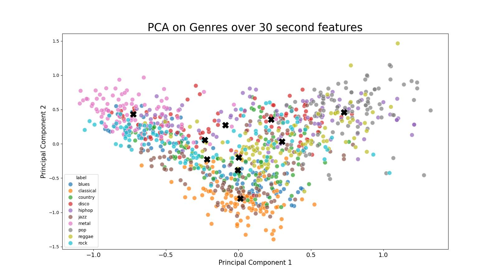
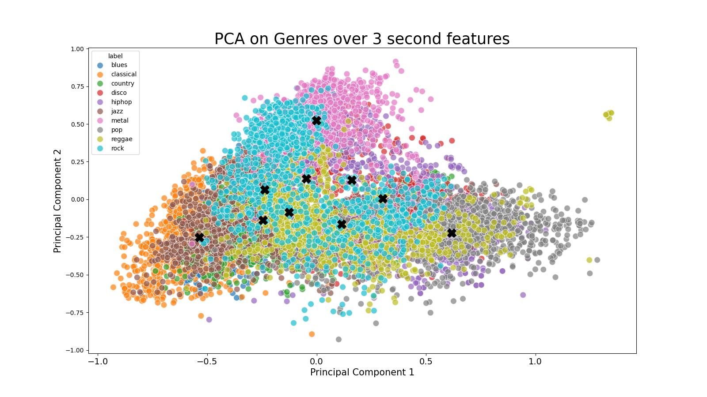

# Test
|  |  |
| ---------------------------------------------------- | ---------------------------------------------------- |  

By viewing the PCA plots side by side we can see that the two plots are similar, but that the centroids for the 30 second plot are further apart than the 3 second plot.  
This is evidenced by the same models being trained on both files separately. The 30 second file scored accuracies of 0.12 and 0.15 in the SVM and XGB models respectively. The 3 second file was marginally better, with accuracies of 0.215 and 0.178 respectively.  
It is however, unclear which factor affected the accuracy. The shorter files may allow specific features to be represented more, while the longer files have to compress 10x more data into the same entry. However, there are also 10 rows per 3 second file compared to 1 row for each 30 second file. This means that there is 10x more data to learn from, and therefore may cause the model to be more accurate.  
Additionally, the SVC model was less accurate than XGB on the 30 second files, but then it was more accurate on the 3 second files. This is likely due to the ways that the two models process data. SVC models attempt to classify data with hyperplanes, and therefore struggle with less specific data, hence why longer files with more noise were more challenging than shorter more specific files. The XGBoost model on the other hand attempts to create numerous weaker decision trees that will form an ensemble, using these weaker decision trees on less specific files may have prevented any of the trees from reaching a higher degree of accuracy.  
A further test was appending the pca values to the features files. This changed the 

The results of each model with: only the PCA values from the 30 second file (2,1), then the results appended onto the data file (60,1)  
CNN, DNN, SVM, XGB - 30 seconds PCA exc - 0.125, 0.160, 0.120, 0.150  
CNN, DNN, SVM, XGB - 30 seconds PCA inc - 0.390, 0.225, 0.460, 0.700  

The results of each model with: only the PCA values from the 3 second file (2,1), then the results appended onto the data file (60,1)  
CNN, DNN, SVM, XGB - 3 seconds PCA exc - 0.194, 0.235, 0.215, 0.178.  
CNN, DNN, SVM, XGB - 3 seconds PCA inc - 0.693, 0.604, 0.606, 0.913.  

The DNN ranks above the CNN when given exclusively PCA features, but the CNN is more accurate when given all of the features. This may be due in part to the CNN having a slightly more complex structure with more trainable parameters.
XGB is significantly more accurate when given all of the features, and on the longer files. However SVM is slightly more accurate on short files with less information. 

https://www.geeksforgeeks.org/support-vector-machine-vs-extreme-gradient-boosting/  
https://medium.com/@ap.nattapoj_st/basic-comparison-between-randomforest-svm-and-xgboost-0e5862871175  

Mel 128 + Spectrogram = 0.545
Mel stack  - 0.565
When stacking chromagrams they are significantly more accurate when reshaped to something like 36x256. 

